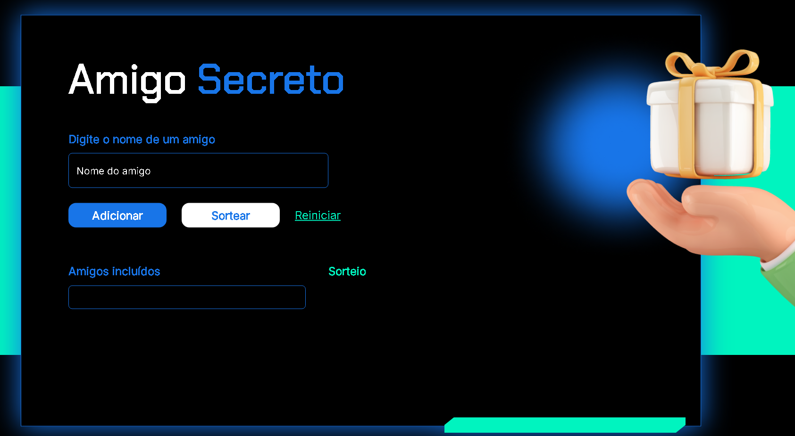

# 🎁 Projeto Amigo Secreto

Este é um projeto de front-end simples e interativo para realizar sorteios de amigo secreto entre amigos, com uma interface moderna e responsiva.

## 📌 Funcionalidades

- ✅ Adicionar nomes de amigos
- ❌ Evita duplicação de nomes
- 🔁 Sorteio automático com resultados exibidos
- 🔄 Reiniciar para novo sorteio

## 🖥️ Tecnologias Utilizadas

- HTML5
- CSS3 (com uso de Normalize.css e Reset CSS)
- JavaScript 

## 📸 Interface

 

## 🧠 Lógica do Sorteio

A função `sortear()` embaralha os nomes adicionados e realiza a associação em cadeia, garantindo que o último sorteado presenteie o primeiro da lista, formando um ciclo fechado.

## 🧪 Como Usar

1. Clone o repositório ou baixe os arquivos.
2. Abra `index.html` em seu navegador.
3. Adicione ao menos **4 amigos**.
4. Clique em **"Sortear"** para ver os pares formados.
5. Use **"Reiniciar"** para começar do zero.

## 👨‍💻 Desenvolvedor

**Murilo Fukushima Rodrigues**  
🔗 [GitHub](https://github.com/Murilofuku)  
🔗 [LinkedIn](https://www.linkedin.com/in/murilo-fukushima-rodrigues-729108302/)
